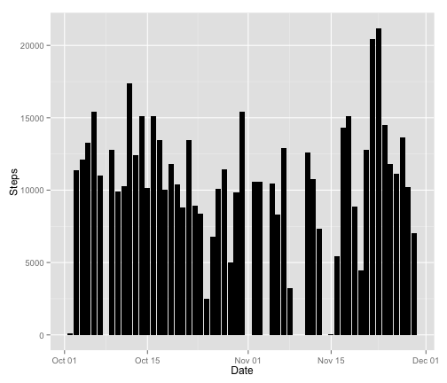
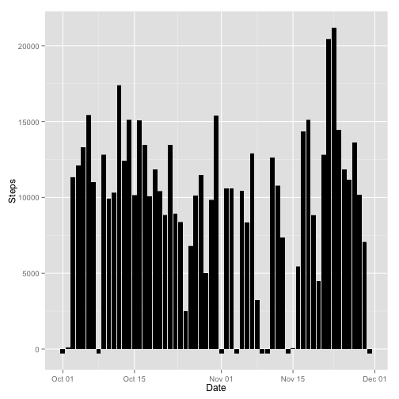

# Reproducible Research - Assignment 1
# ========================================================

This is an R Markdown document. This document has been developed by Venkatesh Thyagarajan.

## Chunk 1: Loading and preprocessing the data

```r
setwd("~/Coursera/Reprodicible Research/Assignment 1")
a1 <- read.csv("activity.csv")
print(nrow(a1))
```

```
## [1] 17568
```

```r
## No of rows: 17568
```

## Chunk 2: Mean total number of steps taken per day

```r
library(ggplot2)
a2 <- data.frame(subset(a1,a1$steps != "NA"))
## No of rows: 15264
a3 <- data.frame(aggregate(a2$steps,by=list(a2$date),FUN=sum))
## No of rows: 53
## Make histogram of total number of steps per day
names(a3) <- c("date","steps")
ggplot(data=a3,aes(x=as.Date(date),y=steps)) + geom_bar(fill="black",stat="identity") + xlab("Date") + ylab("Steps")
```

 

```r
## Calculate mean and median
summary(a3$steps)
```

```
##    Min. 1st Qu.  Median    Mean 3rd Qu.    Max. 
##      41    8841   10760   10770   13290   21190
```

## Chunk 3: Average daily activity pattern

```r
library(ggplot2)
a2mean <- aggregate(a2$steps,by=list(a2$interval),FUN=mean)
a2sum <- aggregate(a2$steps,by=list(a2$interval),FUN=sum)
names(a2mean) <- c("interval","mean")
names(a2sum) <- c("interval","total_steps")
a2merge <- merge(a2mean,a2sum,by.x="interval",by.y="interval",all)
ggplot(data=a2merge,aes(x=interval,y=mean)) + geom_line() + xlab("5-min Interval") + ylab("Mean") +ggtitle("Average number of steps taken per 5-min interval")
```

 

```r
## print interval with maximum number of steps taken
subset(a2merge,a2merge$total_steps == max(a2merge$total_steps))
```

```
##     interval     mean total_steps
## 104      835 206.1698       10927
```

## Chunk 4: Imputing missing values

```r
print("Number of steps with NA")
```

```
## [1] "Number of steps with NA"
```

```r
nrow(subset(a1,is.na(a1$steps)))
```

```
## [1] 2304
```

```r
## Create original data frame with imputed values
a1IMV <- a1
## replace all NA with -1
a1IMV$steps[is.na(a1IMV$steps)] <- -1
ggplot(data=a1IMV,aes(x=as.Date(date),y=steps)) + geom_bar(fill="black",stat="identity") + xlab("Date") + ylab("Steps")
```

```
## Warning: Stacking not well defined when ymin != 0
```

 

```r
summary(a1IMV$steps)
```

```
##    Min. 1st Qu.  Median    Mean 3rd Qu.    Max. 
##   -1.00    0.00    0.00   32.35    0.00  806.00
```

```r
### Note: Imputed values skew the original results
```

## Chunk 5: Activity patterns between weekdays and weekends

```r
a2DAY <- data.frame(a2$date,weekdays(as.Date(a2$date)),ifelse(weekdays(as.Date(a2$date))=="Saturday"|weekdays(as.Date(a2$date))=="Sunday","Weekend","Weekday"),a2$steps,a2$interval)
names(a2DAY) <- c("date","day","type","steps","interval")
a2DAYFinal <- aggregate(a2DAY$steps,by=list(a2DAY$interval,a2DAY$day,a2DAY$type),FUN=mean)
names(a2DAYFinal) <- c("interval","day","type","average_steps")
ggplot(data=a2DAYFinal,aes(x=interval,y=average_steps)) + geom_line() + xlab("Interval") + ylab("Number of steps") +ggtitle("Activity Patterns between Weekday and Weekend") + facet_wrap(~ type,ncol=1)
```

 
